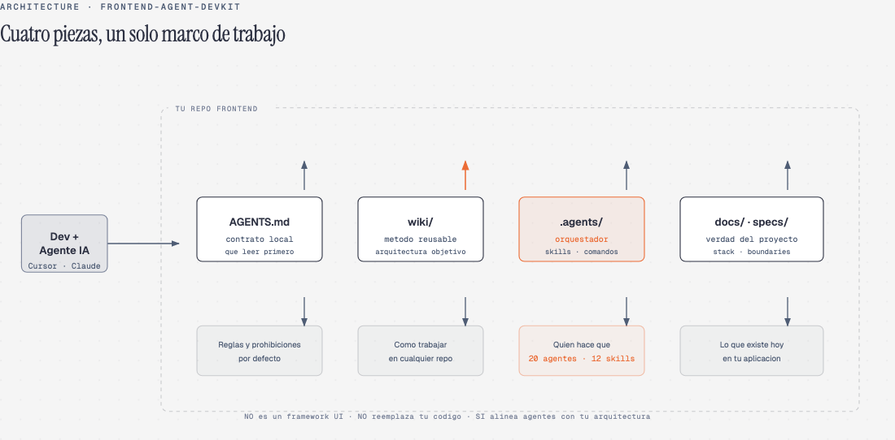
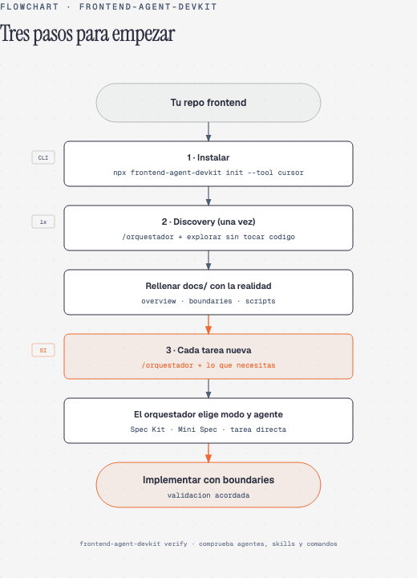
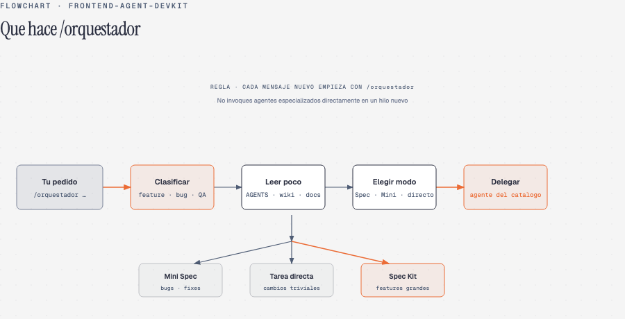
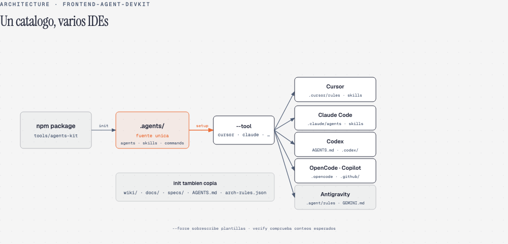

# frontend-agent-devkit

**Capa de trabajo para asistentes de IA en proyectos frontend** — metodo, contrato, agentes y documentacion viva. No reemplaza tu codigo; evita que cada chat improvise arquitectura.

[](https://www.npmjs.com/package/frontend-agent-devkit)
[](LICENSE)

---

## En una frase

Copias el kit en la raiz de tu repo. Los agentes leen **poco y en orden** (`AGENTS.md` → `wiki/` → `docs/`), clasifican cada tarea con **`/orquestador`** y respetan la arquitectura que tu defines.



| Pieza | Que es | Para que sirve |
|-------|--------|----------------|
| **`AGENTS.md`** | Contrato local | Que leer primero, que esta prohibido, como clasificar tareas |
| **`wiki/`** | Metodo reusable | Discovery, specs, arquitectura objetivo, testing |
| **`.agents/`** | Catalogo operativo | 20 agentes, 12 skills, 8 comandos — incluye el **orquestador** |
| **`docs/` · `specs/`** | Verdad del proyecto | Stack, boundaries, integraciones y features **reales** |

> **No es** un framework UI ni una dependencia de tu bundle. **Si es** un marco para que Cursor, Claude Code, Codex y similares dejen de contradecirse entre conversaciones.

---

## Empieza en 3 pasos



```bash
# 1 · Instalar (desde la raiz de tu repo frontend)
npx frontend-agent-devkit init --tool cursor

# 2 · Comprobar
npx frontend-agent-devkit verify
```

**3 · En tu IDE** — primer mensaje tras instalar:

```text
/orquestador Necesito discovery del proyecto sin editar codigo. Resume stack, carpetas, scripts y que actualizar en docs/.
```

Luego rellena `docs/project-overview.md`, `docs/architecture/overview.md` y `docs/architecture/boundaries.md` con lo que descubriste.

**Guia paso a paso:** [docs/readme/GUIA.md](docs/readme/GUIA.md) · Setup detallado: [docs/operations/setup.md](docs/operations/setup.md)

---

## Regla de oro: `/orquestador`

Ante **cada pedido nuevo** (feature, bug, QA, docs…), empieza asi — no invoques agentes especializados directamente en un hilo nuevo.



```text
/orquestador Necesito: <lo que quieres lograr en lenguaje normal>
```

El orquestador te devuelve: tipo de tarea, modo (Spec Kit / Mini Spec / tarea directa), que leer y que agente ejecutar despues.

**Ejemplos y plantillas:** [docs/readme/GUIA.md#orquestador](docs/readme/GUIA.md#orquestador) · Contrato: [`.agents/agents/orchestrator.md`](tools/agents-kit/agents/orchestrator.md)

---

## Un catalogo, tu IDE favorito



```bash
npx frontend-agent-devkit init --tool cursor    # Cursor
npx frontend-agent-devkit init --tool claude    # Claude Code
npx frontend-agent-devkit init --tool codex     # Codex
npx frontend-agent-devkit init --tool copilot   # GitHub Copilot
npx frontend-agent-devkit init --tool all       # Todos
```

`init` copia `wiki/`, `docs/`, `.agents/` y contratos. `setup --tool` replica el catalogo a las rutas que lee cada herramienta. Usa `--force` solo si quieres sobrescribir plantillas existentes.

---

## Arquitectura frontend (detalle fuera del README)

El kit promueve **clean architecture frontend** con lectura gradual. La wiki es el norte; `docs/architecture/` describe **tu** repo.

| Quieres entender… | Abre |
|-------------------|------|
| Capas, dependencias, use cases | [wiki/architecture/frontend-clean-architecture.md](wiki/architecture/frontend-clean-architecture.md) |
| Librerias obligatorias al codificar | [wiki/architecture/library-strategy.md](wiki/architecture/library-strategy.md) |
| Alinear codigo legacy sin migracion masiva | [wiki/delivery/architecture-alignment.md](wiki/delivery/architecture-alignment.md) |
| Estado real y excepciones de tu proyecto | [docs/architecture/overview.md](docs/architecture/overview.md) |

---

## Documentacion

| Necesitas | Enlace |
|-----------|--------|
| Guia completa (instalacion, prompts, referencia) | [docs/readme/GUIA.md](docs/readme/GUIA.md) |
| Contrato para agentes | [AGENTS.md](AGENTS.md) |
| Indice del metodo | [wiki/index.md](wiki/index.md) |
| Catalogo de agentes y skills | [tools/agents-kit/AGENTS-CATALOG.md](tools/agents-kit/AGENTS-CATALOG.md) |
| Spec-driven development | [wiki/delivery/spec-driven-development.md](wiki/delivery/spec-driven-development.md) |
| Changelog | [CHANGELOG.md](CHANGELOG.md) |
| Diagramas del README (fuente HTML) | [docs/readme/diagrams/](docs/readme/diagrams/) |

---

## Para quien es

Equipos que usan **IA en el IDE** y quieren menos improvisacion, **spec-driven development** ligero y **boundaries** claros en frontend — proyectos nuevos o legacy.

## Licencia

MIT · Diagramas con estilo [diagram-design](https://github.com/cathrynlavery/diagram-design).
