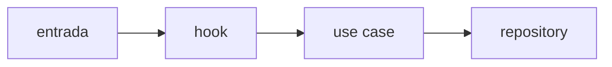

# Arquitectura Y Decisiones: <area>

## Capas Reales

Como se organiza el area HOY y equivalencia con la wiki (`frontend-clean-architecture.md`).

| Carpeta real | Equivale a (wiki) | Notas |
| --- | --- | --- |
| ... | ... | ... |

## Diagrama

## Decisiones Tecnicas Inferidas

| Decision observada | Razon aparente | Confianza |
| --- | --- | --- |
| ... | ... | alta / media / "razon no clara" |

## Desviaciones De La Wiki

Que contradice la arquitectura objetivo y si parece intencional o accidental.
